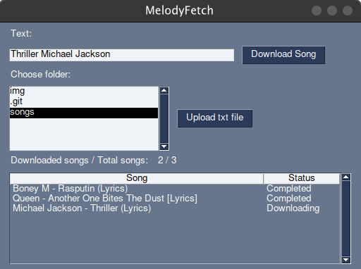
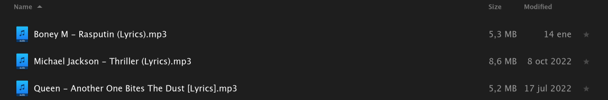

# MelodyFetch

MelodyFetch is an utility to download music in mp3 format from youtube with a basic interface. It provides the following features:
* Download song using youtube link
* Download song using a phrase (this will search in youtube and it will get the first result which matches with)
* Download all songs written in a .txt file (one per line)

The bottom table in the interface will display the current state information for song downloads:

<p align="center">
  
</p>


The program is able to download all the songs you can provide at the same time, so you don't have to wait until it finishes downloading a song.

<p align="center">
  
</p>

## Instructions

### Linux

Clone this repository
```
git clone https://github.com/XileonXL/melodyfetch
```

Install dependencies with *pip*
```
pip install -r requirements.txt
```

Run the program
```
python3 melodyfetch.py
```

## Windows

By default, if you don't have [FFmpeg](https://ffmpeg.org/download.html) installed, it will download the audio in mp4 format instead of mp3. This shouldn't be a problem for you,
but if you need the specific mp3 format you must download the utility and add it in PATH environment variable.

You have three options here.

### Easiest

Download the melodyfetch.exe binary file and just run it.

### Easy

Install [python](https://www.python.org/downloads/windows/) and run it using *command line interface* as you would do for Linux.

### Medium

Create your own binary file:
```
pip install pyinstaller
python -m venv melodyfetch-venv
.\melodyfetch-venv\Scripts\activate
pyinstaller -F melodyfetch.py --paths=.\melodyfetch-venv\Lib\site-packages
```

This will generate different files, but the most important is in *dist* folder, which is the *melodyfetch.exe*.
